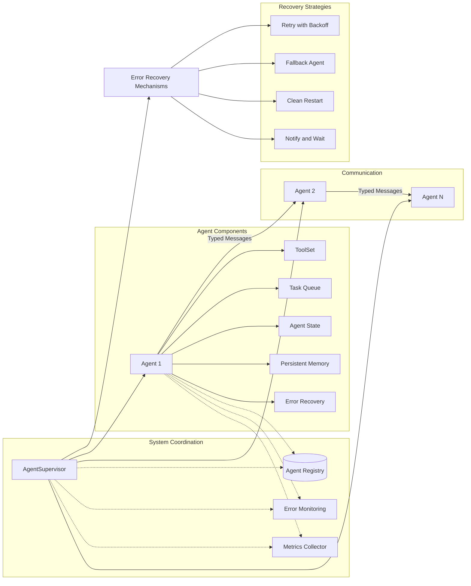

# unchained

[](https://hex.pm/packages/unchained)
[](https://hexdocs.pm/unchained/)

```sh
gleam add unchained
```

## Architecture



## Example

```gleam
import unchained

pub fn main() {
  let tool =
    unchained.Tool(
      name: "format",
      description: "Format the translation",
      function: fn(x) { Ok(string.uppercase(x)) },
    )

  let config =
    unchained.LLMConfig(
      base_url: "localhost:11434",
      model: "llama3.2:3b",
      temperature: 0.0,
    )

  let chain =
    unchained.new()
    |> unchained.add_prompt_template(
      "Translate this to {{ language }}: {{ input }}
    Just reply with the translation, do not include any explanation. Make sure to format the answer first.")
    |> should.be_ok()
    |> unchained.add_llm_with_tool_selection(
      config,
      "Here is the list of tools available to {{ input }}:
    {{#each tools}}
      Function Name: {{name}}
      Function Description: {{description}}
      ---
    {{/each}}

    To use too call it with:

    Tool Selected: <tool name>
    ")
    |> should.be_ok()
    |> unchained.set_variable("input", "lost bread")
    |> unchained.set_variable("language", "French")
    |> unchained.add_llm(config)
    |> unchained.add_tool(tool)

  // Run the chain
  unchained.run(chain)
  |> should.be_ok()
  |> unchained.get_eval_output()
  |> should.equal("PAIN PERDU")
}
```

Further documentation can be found at <https://hexdocs.pm/unchained>.

## Development

```sh
gleam run   # Run the project
gleam test  # Run the tests
```

## TODO

- [ ] Use Iterators for chaining
- [ ] Support for more models: OpenAI, Anthropic, ...
- [ ] Support streaming API
